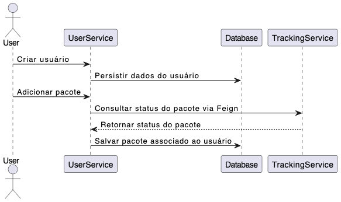

# ShipingService

ShipingService é um sistema para registro e acompanhamento de entregas que consiste em dois microsserviços, **UserService** e **TrackingService**, que interagem entre si usando **OpenFeign** para comunicação HTTP. O **UserService** gerencia usuários e os pacotes associados a eles, enquanto o **TrackingService** lida com o rastreamento de pacotes, armazenando e retornando o status de um determinado pacote. O openfeign garante que a informação do status do pacote exibida para o usuário seja sempre atual.


## Tecnologias Utilizadas

- **Spring Boot 3.3.4**: Framework principal para o desenvolvimento dos microsserviços.
- **OpenFeign**: Cliente HTTP declarativo utilizado para a comunicação entre serviços.
- **PostgreSQL**: Banco de dados relacional para armazenar informações de usuários e pacotes.
- **Docker e Kubernetes**: Ferramentas utilizadas para a containerização e orquestração dos microsserviços.
- **Flyway**: Gerenciamento de migrações de banco de dados.
- **JUnit, MockMvc e testcontainers**: Utilizados para testes unitários e de integração.

## Funcionamento do OpenFeign

O **UserService** possui uma entidade `Package`, onde o método `toString` realiza uma chamada para o **TrackingService** via OpenFeign para recuperar o status do pacote. Esse design permite que o **UserService** obtenha dinamicamente informações de rastreamento sem necessidade de manter o estado do pacote.

### Diagrama de sequencia


Essa abordagem segue o princípio de separação de preocupações, onde cada microservice se concentra em uma funcionalidade específica (o UserService gerencia usuários e o TrackingService gerencia rastreamento). Essa modularidade facilita a manutenção e evolução da aplicação.


## Orquestração com Kubernetes

Os microsserviços são containerizados usando Docker e orquestrados com **Kubernetes**. Cada serviço é configurado com seus próprios deployments e services, e o **Flyway** é utilizado para garantir que os esquemas do banco de dados estejam sincronizados em ambas as instâncias (UserService e TrackingService).


## Estrutura do Banco de Dados

Abaixo estão os esquemas utilizados para o **UserService** e o **TrackingService**, gerenciados pelo **Flyway**.

### Esquema do **UserService**

```sql
CREATE SCHEMA IF NOT EXISTS userservice;

CREATE TABLE IF NOT EXISTS userservice.users (
    id SERIAL PRIMARY KEY,
    email VARCHAR(255) NOT NULL UNIQUE
);

CREATE TABLE IF NOT EXISTS userservice.packages (
    id SERIAL PRIMARY KEY,
    tracking_number VARCHAR(255) NOT NULL UNIQUE,
    user_id INTEGER REFERENCES userservice.users(id)
);
```

### Esquema do **TrackingService**

```sql
CREATE SCHEMA IF NOT EXISTS trackingservice;

CREATE TABLE IF NOT EXISTS trackingservice.packages (
    id SERIAL PRIMARY KEY,
    tracking_number VARCHAR(255) NOT NULL UNIQUE,
    status VARCHAR(255) NOT NULL
);
```

## Iniciando o Sistema com Kubernetes

#### Pré-requisitos

- **Docker**: Para construir as imagens.
- **Kubernetes (Minikube ou Docker Desktop)**: Para orquestração dos microsserviços.
- **kubectl**: Para interagir com o cluster Kubernetes.

### Passos

1. **Build das Imagens Docker**:
   - No diretório de cada microsserviço, execute:
   
   ```bash
   docker build -t userservice:latest .
   docker build -t trackingservice:latest .
   ```

2. **Iniciar o Cluster Kubernetes**:
   - Com Minikube:
   
   ```bash
   minikube start
   ```

3. **Implantar os Microsserviços**:
   - No diretório de cada microsserviço, aplique os manifests do Kubernetes:

   ```bash
   kubectl apply -f k8s/userservice-deployment.yaml
   kubectl apply -f k8s/trackingservice-deployment.yaml
   ```

4. **Configurar o PostgreSQL**:
   - Aplique os manifests para o banco de dados:

   ```bash
   kubectl apply -f k8s/postgres-deployment.yaml
   ```

5. **Acessar os Serviços**:
   - Verifique os serviços com `kubectl get services` e acesse via Minikube:

   ```bash
   minikube service userservice
   minikube service trackingservice
   ```

Esses passos resumem o processo de inicialização do sistema, permitindo que os microsserviços sejam orquestrados e acessados no Kubernetes.

## Comandos CURL para Testes

### Criar um usuário

```bash
curl -X POST http://localhost:8081/users \
-H "Content-Type: application/json" \
-d '{"email": "test@example.com"}'
```

### Adicionar um pacote a um usuário

```bash
curl -X POST http://localhost:8081/users/1/packages \
-H "Content-Type: application/json" \
-d '{"trackingNumber": "123ABC"}'
```

### Atualizar o status de um pacote no **TrackingService**

```bash
curl -X PUT http://localhost:8082/packages/123ABC \
-H "Content-Type: application/json" \
-d '"shipped"'
```

### Consultar as informações de um usuário e seus pacotes

Essa chamada acionará o método `toString` do **UserService**, que, por sua vez, chamará o **TrackingService** para obter o status de cada pacote.

```bash
curl -X GET http://localhost:8081/users/1
```

## Licença

Este projeto está licenciado sob a [Creative Commons Zero v1.0 Universal (CC0 1.0)](https://creativecommons.org/publicdomain/zero/1.0/), permitindo total liberdade para copiar, modificar, distribuir e usar o conteúdo para qualquer propósito, sem restrições. Não é necessário dar atribuição ou obter permissão.


---

